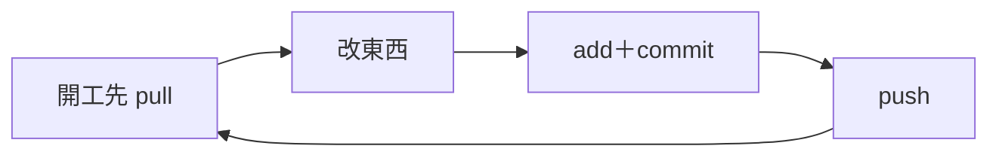
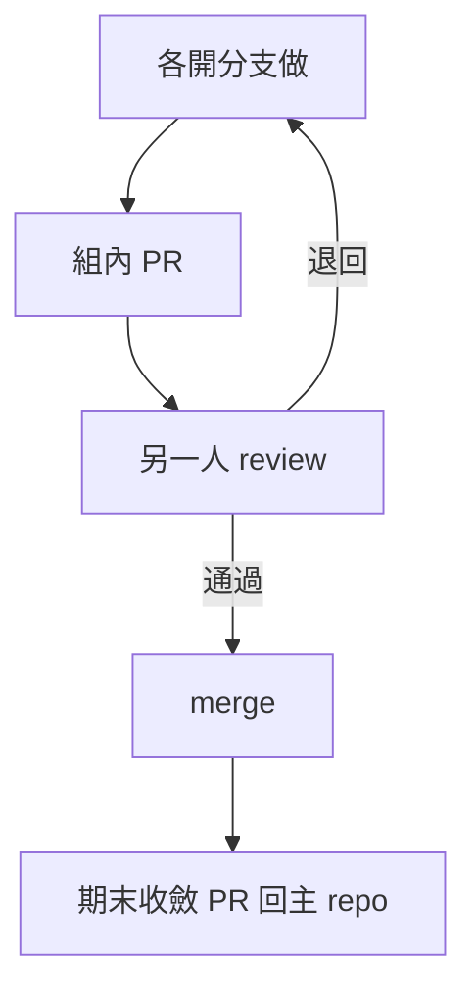
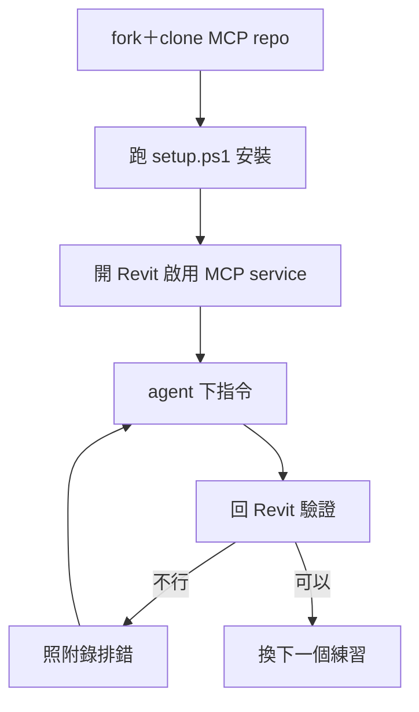
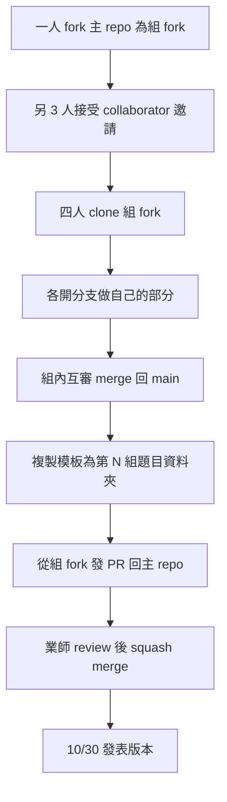

# 2026-10-02 GitHub + Revit MCP + AI 協作

- 主題：GitHub 工作流 + Revit MCP；搭配 coding agent 與 GitHub 協作
- 參考：[shuotao/REVIT_MCP_study](https://github.com/shuotao/REVIT_MCP_study)
  （repo 內 `slides/` 有投影片可用；知識網站 https://shuotao.github.io/REVIT_MCP_study/ ）
- 環境假設：Revit 2024 學生版、學生自備電腦、每組 3–4 人（暫定）、coding 0 經驗、agent 不限定
- 本檔即簡報內容來源：每節對應投影片章節

## 課前準備

### 學生端（9/18 或 10/2 前通知，課前完成）

1. **開 GitHub 帳號**：免費註冊＋收驗證信開通（課前完成，沒帳號後面全卡住）
2. **Revit 2024 學生版**：Autodesk 教育帳號（免費）申請＋安裝＋啟用
   - 注意：學生版與商業版檔案不相容、學生版有檔案大小限制，課程檔案一律用學生版產出
3. **Node.js LTS（20.x 以上）**
4. **裝 Git**：`git config` 設好姓名與 email（對應第 1 項的帳號）
5. **選一個 coding agent**（不限定，看個人想用誰）並裝好、登入：
   - Claude Code
   - VS Code（Copilot）
   - Gemini CLI
   - Antigravity
   - OpenCode（MCP 設定同概念：指向 `npx -y @shuotao/revit-mcp-server`）
   - repo 內有 Claude / Gemini / VS Code / Antigravity 的現成 config template 可複製
6. **Fork** `shuotao/REVIT_MCP_study`，讀 README「Quickstart」
7. **跑完 `.\scripts\setup.ps1`**：裝依賴、build MCP server、build＋部署 Revit 2024 add-in、
   配 agent。跑不通的人把錯誤訊息記下來，上課帶來處理
   （build 需要 .NET SDK；腳本會檢查，缺什麼照提示裝）

### 業師端

- [ ] 示範機：Revit 2024 學生版（add-in 已部署）+ MCP server + 至少一個 agent 全流程跑通
- [ ] 示範模型：**用學生版 Revit 2024 建**（有樓層、牆、房間即可，保持小檔案），確認學生版開得起來
- [ ] add-in：`dotnet build -c Release.R24` → `.\scripts\install-addon.ps1 -Version 2024`
- [ ] 主 repo `main` 開分支保護：禁直接 push，只能 PR 合併
- [ ] 教室網路確認能 `npx -y @shuotao/revit-mcp-server`（或預先下載 npm 套件）
- [ ] 備用：一台裝好的備用機，學生環境救不回時頂上

## 課程內容

### Part 1｜GitHub + coding agent 入門

對象是 0 經驗，以示範＋跟做為主，少用名詞。

- **概念**
  - repo / commit / push / issue / PR，用「群組共寫一份 BIM 模型說明」的情境講；
    為什麼二次開發要版本控制
  - agent 是什麼：LLM 會「叫工具」→ MCP 讓 agent 直接操作 Revit，
    Revit 從「滑鼠操作」變成「結構化資料介面」（點題：這是之後三次課的主軸）
  - **AI 協作三原則**：
    1. 給情境：跟 agent 講清楚專案、視圖、目標，越具體越可靠
    2. agent 會錯：模型任何改動都要回 Revit 驗證，截圖就是證據
    3. 可追溯：改動都用 commit 進 repo；大改動前先存一份模型備份
  - GitHub 在這些課的定位：版本控制＋協作＋agent 的「軌道」
- **跟做**：業師畫面示範，學生同步操作：
  1. `git config`；組內一人 fork 主 repo（組 fork），把另 3 人加為 collaborator，再 clone 到本機
  2. 改 README 一行 → commit → push（版本控制最小循環）
  3. **大檔案不進 repo**：`.rvt` 是二進位大檔，留在本機／群組共享資料夾；
     repo 放腳本、匯出資料（JSON／排程表）、文件、截圖
  4. **避免衝突**：組內同一時間只有一人 push；動手前先 `git pull` 同步
  5. 開一個 issue → 叫 agent 解掉並提 PR（組內 PR；issue → agent → PR 全流程，
     學生看流程，挑一組上機試）
  6. **跟上游同步**：主 repo 更新時（老師加模板、改文件），組長到組 fork 網頁按
     Sync fork → Update branch，其他人再 `git pull`
- **常用操作流程（個人／團體）**：只教到發表會用到的
  - 起手式（每個專案只做一次）：
    1. 開 repo（GitHub 網頁按 New，取名就好）或 fork（按 Fork 變成自己的）
    2. 加 collaborator（Settings → Collaborators，對方接受邀請後才能 push）
    3. 每人 `git clone <repo URL>` 一次；之後同步都用 pull
  - 個人：開工 `pull` → 改 → `add＋commit` → `push`；有問題開 issue
  - 團體：各開分支 → 組內 PR＋互審 → merge；主 repo 更新組長 Sync fork；期末收斂 PR 回主 repo（細節見 Part 4）
  - 卡住或衝突：先停手不要硬解，找業師

個人日常循環：



團體協作：



### Part 2｜Revit MCP：連上＋第一次 tool call

- **架構＋MCP 是什麼**：

  ```
  AI client (Claude Code / VS Code / Gemini CLI / Antigravity / OpenCode)
    │ stdio
  MCP server (Node.js, npx @shuotao/revit-mcp-server)
    │ WebSocket ws://localhost:8964
  Revit add-in (C#)
    │ Revit API
  Autodesk Revit 2024
  ```

  MCP ＝ 讓 AI「叫工具」的標準協定：不是自由聊天，是有輸入／輸出的結構化呼叫，
  所以結果可預期、可驗證。192 個 MCP tools + 83 個 BIM SOP。
  注意：**同一時間只有一個 agent 能連上 Revit**（獨佔鎖，第二個會被 409 拒）。
- **邊界與風險**：
  - 模型檔是單一真相：agent 只會改「目前打開」的專案，其他視圖／專案不受影響
  - 大改動前：先另存副本＋確認 autosave；搞壞又沒存檔，關掉重開就回到最後存檔狀態
  - 所以 Part 1 的第三原則（可追溯＋備份）在 Revit 端也成立
- **連線驗證＋排錯**：課前已跑 setup.ps1，課上是驗通＋救火。先盤點：已完成的直接驗證；
  沒 fork／沒跑完的現場 fork `shuotao/REVIT_MCP_study`＋跟著跑（備用機頂上）：
  1. 開 Revit → ribbon 啟用 MCP service（確認 listen `localhost:8964`）
  2. 重開 agent → 叫 tool：「告訴我這個專案有幾層、列出所有樓層」
  3. 再叫一個：「在目前視圖放一個文字標註」→ 回 Revit 驗證
  4. 不順的人照附錄排；業師巡場
  5. 跑完的人直接開始 Part 3 任務

### Part 3｜實作：取得＋安裝＋使用

- 目標：每組把 MCP 跑起來，用 agent 對模型做「資料讀取＋小幅修改」；做出來為止，不用 commit／PR
- 步驟：
  1. 取得：確認每組都有 fork＋clone `shuotao/REVIT_MCP_study`（Part 2 已帶過）
  2. 安裝：跑完 `setup.ps1`（build MCP server＋部署 add-in＋配 agent）；卡住照附錄排，業師巡場
  3. 使用：開 Revit → 啟用 MCP service → agent 下指令 → 回 Revit 驗證
- 使用練習（由低到高）：
  1. 匯出所有門窗為明細表
  2. 批次重命名樓層／新增一個視圖
  3. 在視圖中畫文字標註、建立簡單排程表（schedule）
  4. 自由試：想得到的指令都丟給 agent（驗證＋截圖留底，寫 10/16 作業用得到）
- 3–4 人分工：**drive agent 1 人、Revit 驗證 1 人、記錄＋排錯 1 人**
  （4 人組多一個報告；輪流換）



### Part 4｜期末交件操作：小組 fork→PR

- 課上跟著走一遍（流程正本見根 README「交件流程」）：
  1. 組內一人 fork 主 repo（組 fork），把另 3 人加為 collaborator
  2. 四人 clone 組 fork；分工沿用 Part 3，發 PR 由記錄兼
  3. 各開分支做 → 組內互審 merge → 收斂到一條分支，內容只動 `20261030/第X組_應用名稱/`（模板複製改名）
  4. 從組 fork 發 PR 回主 repo（標題＝組別＋題目）；業師 review 後 squash merge
  5. 截止 10/29 23:59；merge 完的版本就是發表＋投票用



- **作業**：每組 10/16 前於組 fork 開一個 issue：
  - 標題＝想做的二次開發方向（不限定）
  - 內文＝初步做法、需要 Revit 哪些結構化資料
- **預告 10/16**：RFI（Request for Information）是什麼、
  為什麼「議題追蹤」和 Revit 模型元素對得上（模型元件可被打標、追蹤狀態）；
  同學的開發方向可以不同，RFI 只是一個完整範例
- 收尾：每組用一句話講今天學到什麼／最難卡住的地方（常見問題見附錄）

## 附錄：常見問題（課上隨查）

| 症狀 | 檢查 |
|------|------|
| agent 找不到 Revit tools | MCP server 有沒有 build；config 指對 `MCP-Server/build/index.js`；重啟 agent |
| MCP 連不上 Revit | Revit 有開、ribbon 開 MCP service、port 8964 沒被佔（`scripts\release-port.ps1`） |
| ribbon 沒有 MCP 面板 | `.addin` + DLL 有沒有 deploy 到 `%APPDATA%\Autodesk\Revit\Addins\{version}`，重開 Revit |
| 兩個 agent 想同時連 | 同一時間只容許一筆連線；ribbon「切換/釋放連線」後再接另一個 |
| 模型被改壞 | 沒存檔就關掉重開，回到最後存檔狀態；有備份副本就還原 |
| 學生版開不了檔案 | 檔案是商業版建的；學生版與商業版不相容，改從群組 repo 領學生版檔案 |
